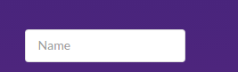

This a review for [Semantic UI](http://semantic-ui.com/) which was tested by [our team](link site#our team) last month for building a presentation website.

There are many available front-end frameworks like [Bootstrap](http://getbootstrap.com/), [Foundation](http://foundation.zurb.com/), [HTML Kickstart](http://www.99lime.com/elements/) or [Ivory](https://github.com/kanthvallampati/IVORY), but we decided to go with [Semantic UI 2.2]
(http://semantic-ui.com/) to build a website. 

The framework is easy to install. There is a [step-by-step online guide](http://semantic-ui.com/introduction/getting-started.html) which describes in detail what and how you need to install and configure so that everything is correctly set up.

They provide support and installation steps for Linux, Mac and Windows which makes the framework easy to be used by teams whose contributing members work on different operating systems.

The JS library contains a lot of preconfigured UI components: views, elements, icons, modules, etc. backed by a consistent online documentation and live examples. Beside the common components (like labels, buttons, forms, etc.), they provide some enhanced ones with more logic behind. See the below example:

We need a form with one field which is mandatory to be filled in. Otherwise, a sticky label attached to that textfield will prompt the missing text error. 

    <form class="ui fluid form" onsubmit="return validateAndSubmit()" method="POST">
        

            <input type="text" name="name" placeholder="Name" id="name">
                

                

        

	</form>

Available CSS are easy to use because their names are in natural language. For example, if you need a small, circular button containing the facebook icon (which by the way has already the appropriate style in place), you only need to add the specific style class:
 
    <button class="ui circular small facebook icon button">

Another useful feature is the ability to use [theming](http://semantic-ui.com/usage/theming.html) to configure some parameters efficiently and consistently across the entire website. Basically, each UI component inherits the style from the theme and the existing pre-defined style classes available in the library (e.g. "UI modal") specify how a component should differ from the default theme. It is not configured from scratch every time. If a completely new layout is required, one can define a particular style class which will override the default style.

Still, Semantic UI is not very optimized for mobile/different types of browsers. Some of the layouts are displayed differently on different browser and on mobile. The scaling does not always work as expected. The "stackable" keyword in CSS class name could be used to ensure
a proper scaling but it might reorganize the horizontal layouts that might not fit in anymore. 
	{add example/code here}

For editing the HTML, CSS or JS files, any web editor will do it. We used [Brackets](http://brackets.io/) because it compiles the code in real time and it shows you the errors before running it in a browser. 
  {add printscreen here}

To draw a conclusion, Semantic UI is an user friendly framework with lots of online documentation that enables any software engineer to easily develop expressive websites in a short amount of time.
